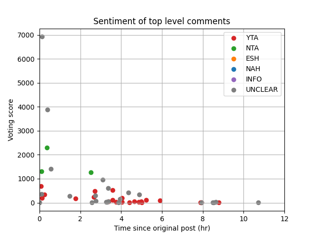
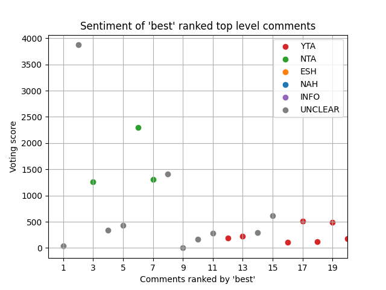
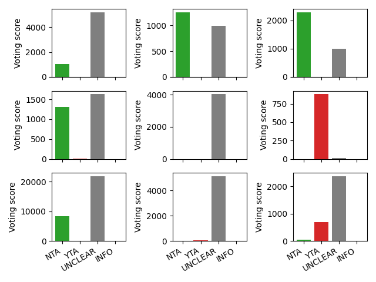
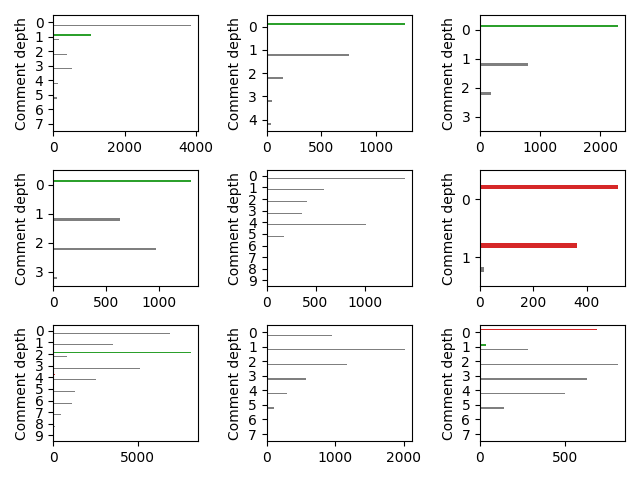
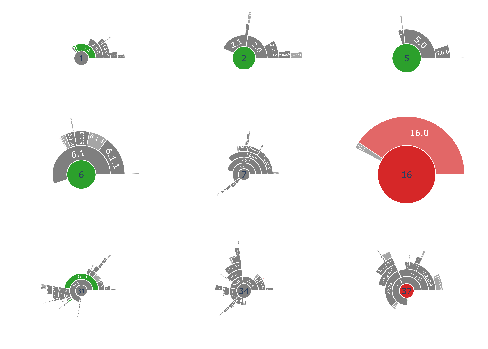

# reddit_aita_post_analysis

[](https://github.com/stevenaleung/reddit_aita_post_analysis/actions/workflows/ci.yml?query=branch%3Amain)
[](https://codecov.io/gh/stevenaleung/reddit_aita_post_analysis)


A package to analyze posts from reddit.com/r/AmItheAsshole/

## Quick start

```python
import reddit_aita_post_analysis.util as util
import reddit_aita_post_analysis.visualization as vis
import matplotlib.pyplot as plt

post_id = "cd7vyz"

reddit = util.get_reddit_connection()
post = util.get_post(reddit, post_id)
post_df = util.to_dataframe(post)

# user finds the subset of data they want to plot
# in this example, find comments with the highest total score
sum_df = post_df.groupby(["tlc_idx"]).sum()
sorted_df = sum_df.sort_values(by="comment_score", ascending=False)
num_comments = 9
top_scoring_idxs = sorted_df.index[:num_comments]
comments_df = post_df.loc[post_df["tlc_idx"].isin(top_scoring_idxs)]
```

### Create scatter plots to show top level judgements 
```python
num_hours_cutoff = 12
fig = vis.create_top_level_score_vs_time_figure(post_df, num_hours_cutoff)
fig.show()
```


```python
num_comments = 20
fig = vis.create_top_level_score_vs_ranking_figure(post_df, num_comments)
fig.show()
```


### Create bar charts to show total judgement scores
```python
fig = vis.create_total_score_figure(comments_df)
fig.show()
```


### Create bar charts to show judgement scores per comment depth
```python
fig = vis.create_score_per_depth_figure(comments_df)
fig.show()
```



### Create sunburst charts to show judgement scores per comment depth
```python
fig = vis.create_sunburst_figure(comments_df)
fig.show()
```

